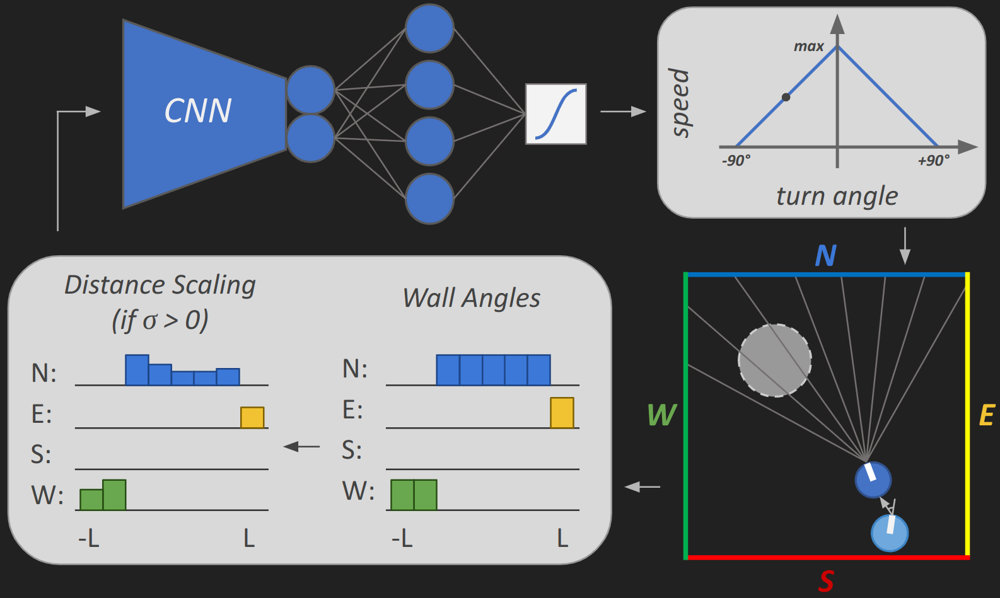
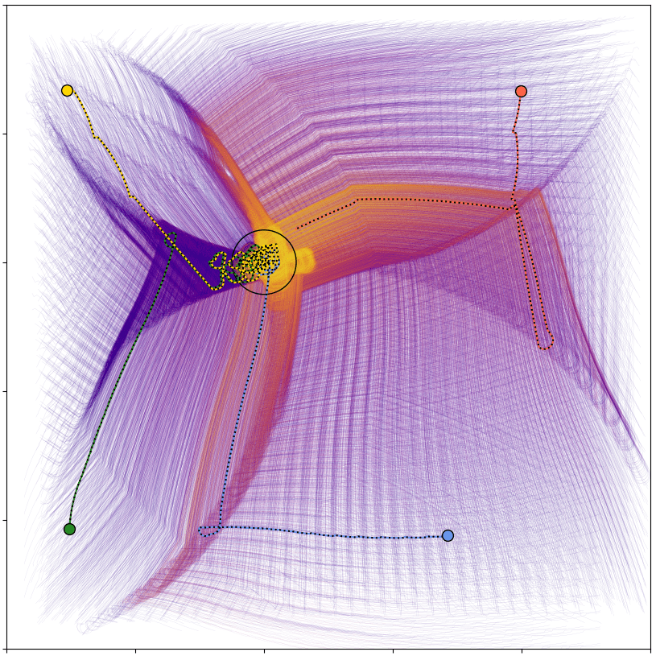
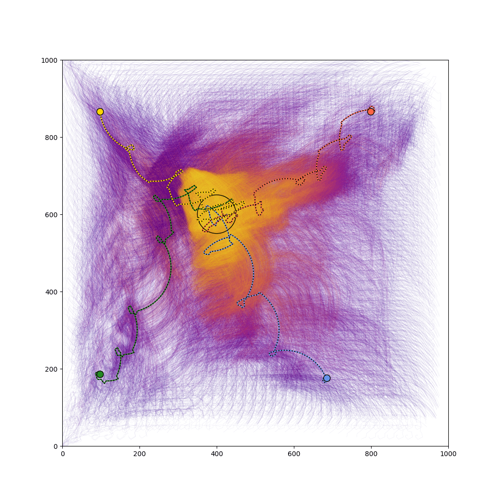
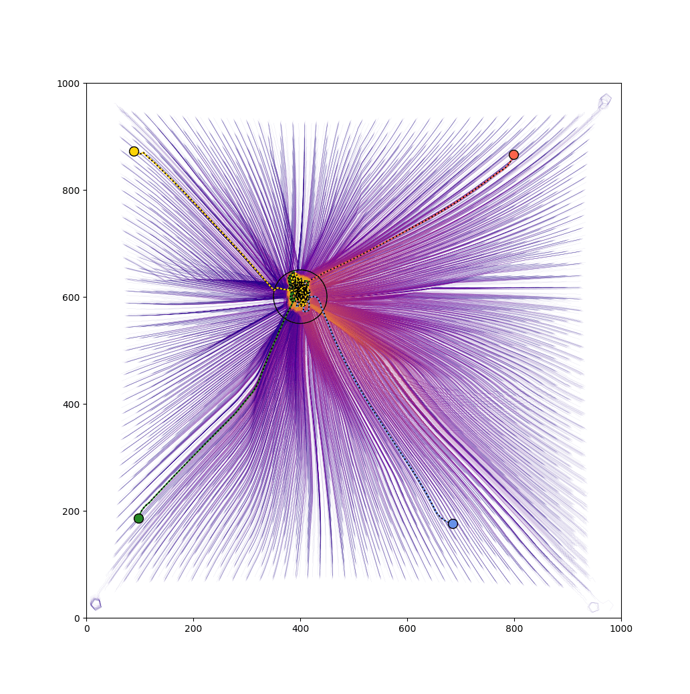
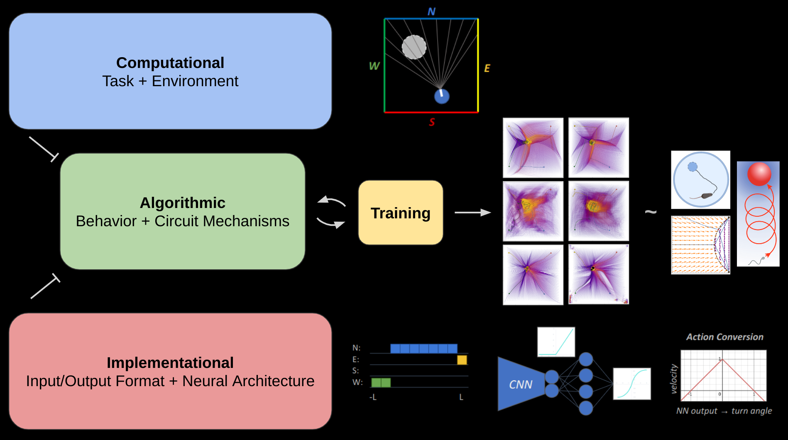

# Fundamental Visual Navigation Algorithms: *Indirect Sequential, Biased Diffusive, & Direct Pathing*

**Author of Model:** Patrick Govoni  
**Supervisors:** Prof. Pawel Romanczuk  
**Affiliation:** Institute for Theoretical Biology, Department of Biology, Humboldt Universität zu Berlin  
**Group:** Collective Information Processing Lab  
**Timespan:** 2023-2024

**Abstract:**  
Effective foraging in a predictable local environment requires coordinating movement with observable
spatial context - in a word, navigation. Distinct from search, navigating to specific areas known to
be valuable entails its own particularities. How space is understood through vision and parsed for
navigation is often examined experimentally, with limited ability to manipulate sensory inputs and
probe into the algorithmic level of decision-making.

As a generalizable, minimal alternative to empirical means, we evolve and study embodied neural
networks to explore information processing algorithms an organism may use for visual spatial
navigation. Surprisingly, three distinct classes of algorithms emerged, each with its own set of rules
and tradeoffs, and each appear to be highly relevant to observable biological navigation behaviors.

  
  
  

  
  
  

**Manuscript:**  
[Preprint]()  

**Citation:**  
Govoni, P., Romanczuk, P. Fundamental Visual Navigation Algorithms: Indirect Sequential, Biased Diffusive, & Direct Pathing. (2024). 

**License:**  
Copyright © 2022 [Patrick Govoni](https://github.com/pgovoni21).  
This project is [MIT](https://github.com/pgovoni21/vis-nav-abm/blob/main/LICENSE) licensed.
