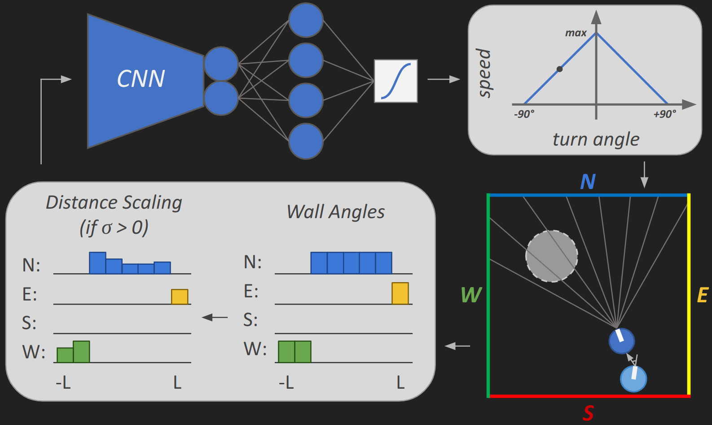
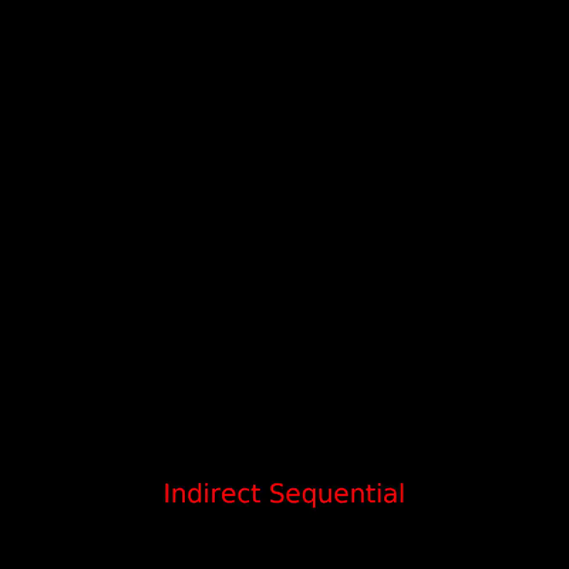
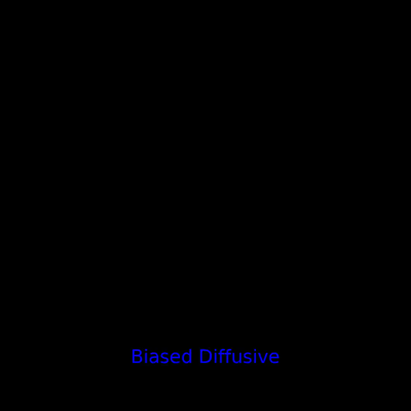
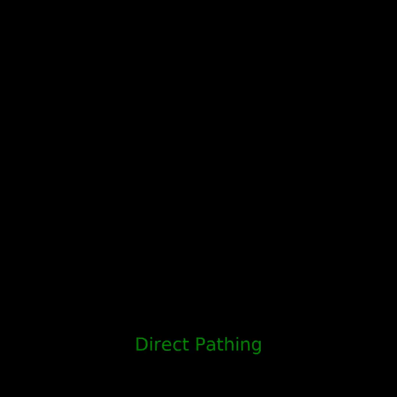
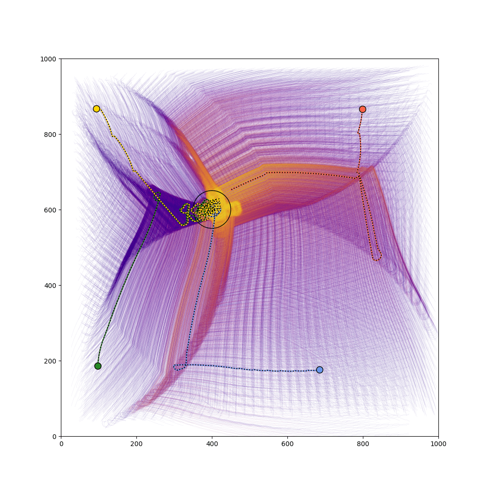
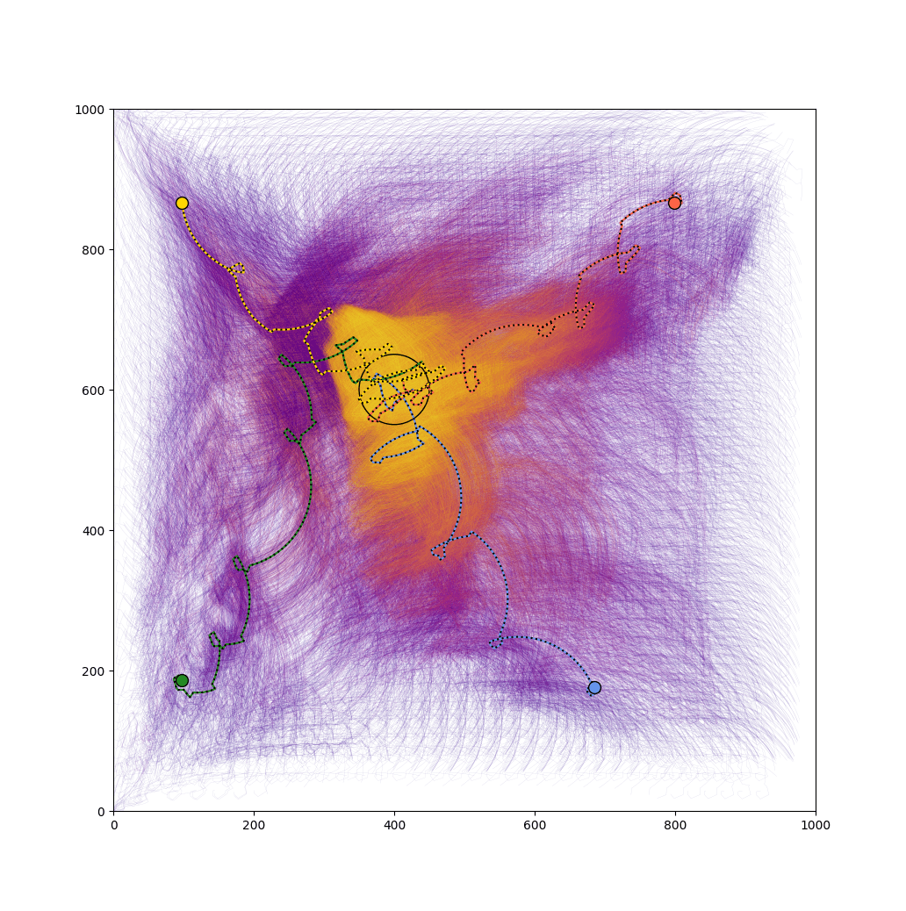
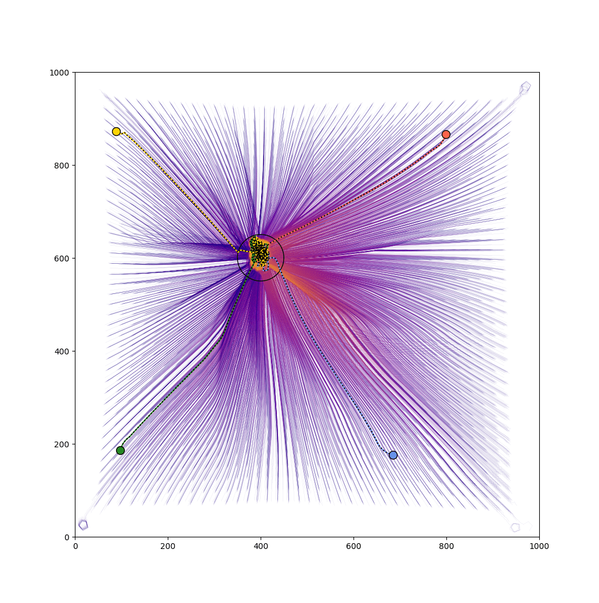
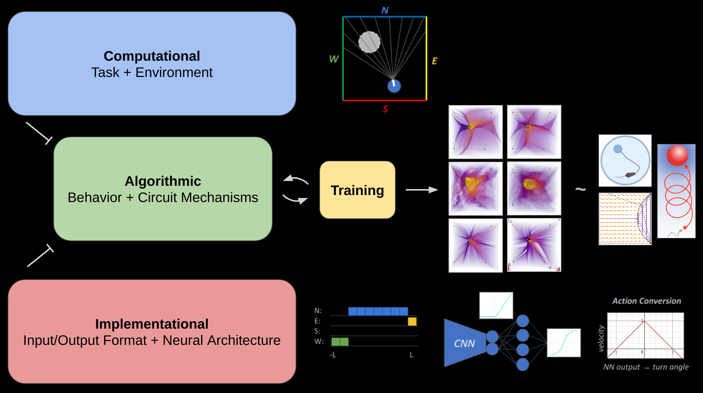

# Visuospatial navigation from the bottom-up: without vestibular integration, distance prediction, or maps

**Author of Model:** Patrick Govoni  
**Supervisors:** Prof. Pawel Romanczuk  
**Affiliation:** Institute for Theoretical Biology, Department of Biology, Humboldt Universität zu Berlin  
**Group:** [Collective Information Processing Lab](http://lab.romanczuk.de/)  
**Timespan:** 2023-Present

**Abstract:**  
Navigation is believed to be controlled by at least two partially dissociable systems in the brain. The cognitive map informs an organism of its location and bearing, updated by integrating vestibular self-motion or predicting distances to landmarks. Route-based navigation, on the other hand, directly evaluate sequential movement decisions from immediate percepts. Here we demonstrate the sufficiency of visual route-based decision-making in a classic open field navigation task often assumed to require a cognitive map. Three distinct strategies emerge to robustly navigate to a hidden goal, each conferring contextual tradeoffs analyzed at both neural and behavioral scales, as well as qualitatively aligning with behavior observed across the biological spectrum. We propose reframing navigation from the bottom-up, through an egocentric episodic perspective without assuming online access to computationally expensive top-down representations, to better explain behavior under energetic or attentional constraints.

  
  
  

  
  
  

**Behavioral Convergence:**

**Manuscript:**  
[Preprint](https://arxiv.org/abs/2407.13535v2)  

**Citation:**  
Govoni, P., Romanczuk, P. Visuospatial navigation from the bottom-up: without vestibular integration, distance prediction, or maps. (2025). 

**License:**  
Copyright © 2023 [Patrick Govoni](https://github.com/pgovoni21).  
This project is [MIT](https://github.com/pgovoni21/vis-nav-abm?tab=MIT-1-ov-file) licensed.
